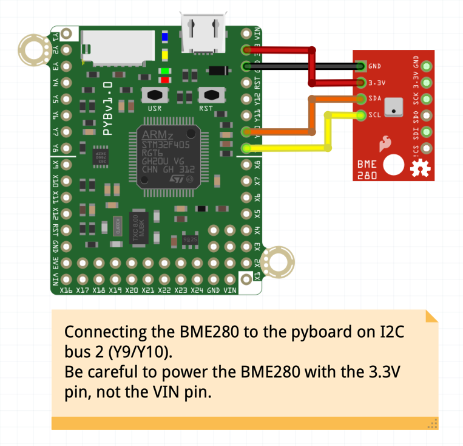
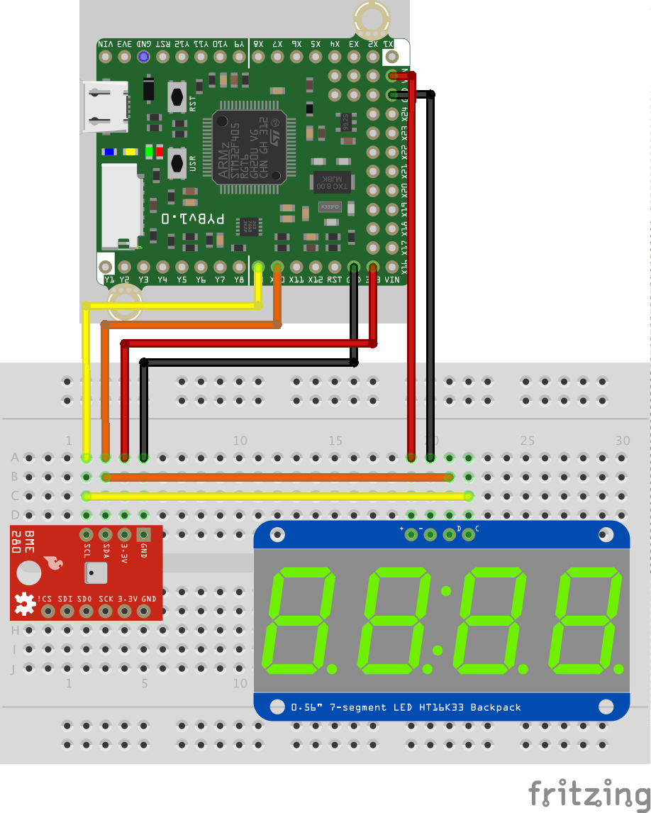

# BME280
A pyboard Micropython module for the BME280 temperature, pressure and humidity sensor.

Connect as follows for bme280_test.py

If you have Adafruit 7-segment LED display with HT16K33 backpack, you may try this with bmedisplay.py:

© Frédéric Boulanger <frederic.softdev@gmail.com>  
2019-08-27  
This software is licensed under the Eclipse Public License 2.0
